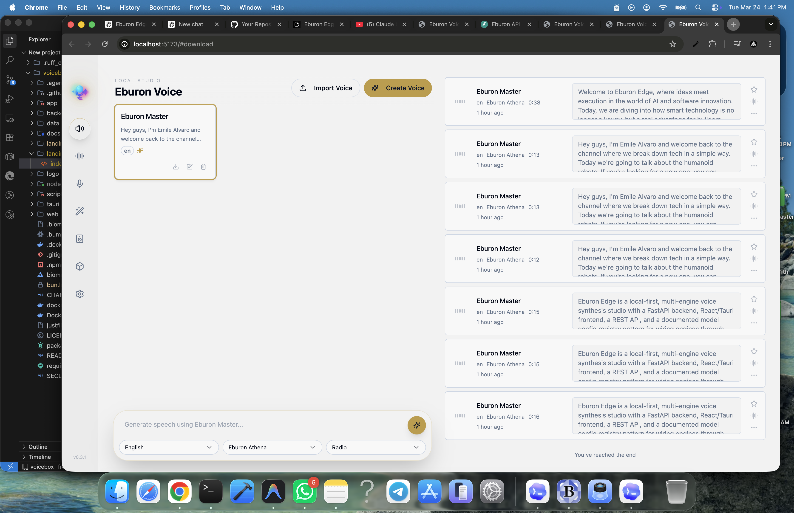

<p align="center">
  
</p>

<h1 align="center">Eburon Edge Voice</h1>

<p align="center">
  <strong>Sovereign Vocal Synthesis. unleashed locally.</strong><br/>
  Clone identities. Orchestrate narratives. Apply studio-grade DSP.<br/>
  All executing entirely on your own infrastructure.
</p>

<p align="center">
  <a href="https://eburon.ai">eburon.ai</a> •
  <a href="https://docs.eburon.ai">Docs</a> •
  <a href="#download">Download</a> •
  <a href="#features">Features</a> •
  <a href="#api">API</a>
</p>

<br/>

<p align="center">
  <a href="https://eburon.ai">
    
  </a>
</p>

<p align="center">
  <em>Experience the Pantheon of Engines at <a href="https://eburon.ai">eburon.ai</a></em>
</p>

<br/>

<p align="center">
  
</p>

<p align="center">
  
</p>

<br/>

## What is Eburon Edge Voice?

Eburon Edge is a **local-first voice cloning studio** — a premium, open-source alternative to ElevenLabs. It enables the replication of vocal identities from mere seconds of audio, generating high-fidelity speech across 23 languages using our unique **Goddess-tier Pantheon engines**. 

Designed for creative professionals and developers, it features a nonlinear DAW-style timeline for complex narrative production and an autonomous CSR Agent for real-time conversational AI.

- **Total Sovereignty** — Biometric voice data and neural weights stay on your machine.
- **The Pantheon** — 7 specialized engines: Athena, Iris, Hestia, Hera, Nike, Artemis, and Gaia.
- **Expressive Synthesis** — Native paralinguistic tag support (`[laugh]`, `[sigh]`, `[gasp]`) via Eburon Nike.
- **Pedalboard DSP** — Studio-grade effects (Pitch, Reverb, Compression) via Spotify’s Pedalboard.
- **Nonlinear Editor** — Multi-track timeline for podcasts, audiobooks, and mixed dialogue.
- **Autonomous CSR** — Real-time conversational agent with sub-100ms latency and empathy metrics.
- **Hardware Optimized** — Built with Tauri (Rust) for native performance on Metal, CUDA, and ROCm.

---

## Download

| Platform              | Download                                               |
| --------------------- | ------------------------------------------------------ |
| macOS (Apple Silicon) | [Download DMG](https://github.com/lovegold120221-dot/eburon-edge-voice/releases/latest)   |
| macOS (Intel)         | [Download DMG](https://github.com/lovegold120221-dot/eburon-edge-voice/releases/latest) |
| Windows               | [Download MSI](https://github.com/lovegold120221-dot/eburon-edge-voice/releases/latest)   |
| Docker                | `docker compose up`                                    |

> **[View all architectural binaries →](https://github.com/lovegold120221-dot/eburon-edge-voice/releases/latest)**

---

## The Pantheon: Engine Registry

| Engine                      | Architecture | Strengths                                                                                                                                |
| --------------------------- | ------------ | ---------------------------------------------------------------------------------------------------------------------------------------- |
| **Eburon Athena** (1.7B)  | 10 Langs     | High-fidelity cloning with delivery instructions ("speak slowly", "whisper").                                                     |
| **Eburon Iris** (0.6B)    | 10 Langs     | Efficient, low-VRAM footprint for rapid iteration on standard consumer hardware.                                                                                  |
| **Eburon Hestia**          | English      | Lightweight (~1GB VRAM), 48kHz output, reaching 150x realtime speeds on CPU.                                                                              |
| **Eburon Hera**            | 23 Langs     | Broadest linguistic coverage including Arabic, Hindi, Swahili, Hebrew, and Turkish. |
| **Eburon Nike**            | English      | Expressive engine supporting paralinguistic sound tags inline with text.                                                                                   |
| **Eburon Artemis** (1B)    | 10 Langs     | High-precision text-acoustic alignment for synchronized cinematic storytelling.                                                                      |
| **Eburon Gaia** (3B)       | 10 Langs     | Extended coherence for long-form synthesis (chapters and manuscripts).                                                            |

### Paralinguistic Markers
When using **Eburon Nike**, you can insert expressive tags directly into the manuscript:
`[laugh]` `[chuckle]` `[gasp]` `[cough]` `[sigh]` `[groan]` `[sniff]` `[shush]` `[clear throat]`

---

## Technical Stack

| Layer         | Technology                                        |
| ------------- | ------------------------------------------------- |
| **Studio App**   | Tauri (Rust)                                      |
| **Interface**      | React, TypeScript, Tailwind CSS (Obsidian/Bronze Theme) |
| **State**         | Zustand, React Query                              |
| **API Backend**       | FastAPI (Python)                                  |
| **DSP Engine**       | Pedalboard (Spotify)                              |
| **Transcription** | Eburon Orbit (Whisper-based)                      |
| **Inference**     | MLX (Apple Silicon) / PyTorch (CUDA/ROCm/DirectML) |
| **Database**      | SQLite                                            |

---

## API & Integration

Eburon Edge exposes a local REST API for studio automation and third-party app integration.

```bash
# Initialize Synthesis
curl -X POST http://localhost:17493/generate \
  -H "Content-Type: application/json" \
  -d '{
    "text": "The future of vocal synthesis is local. [sigh]",
    "engine": "nike",
    "profile_id": "ep_001"
  }'
